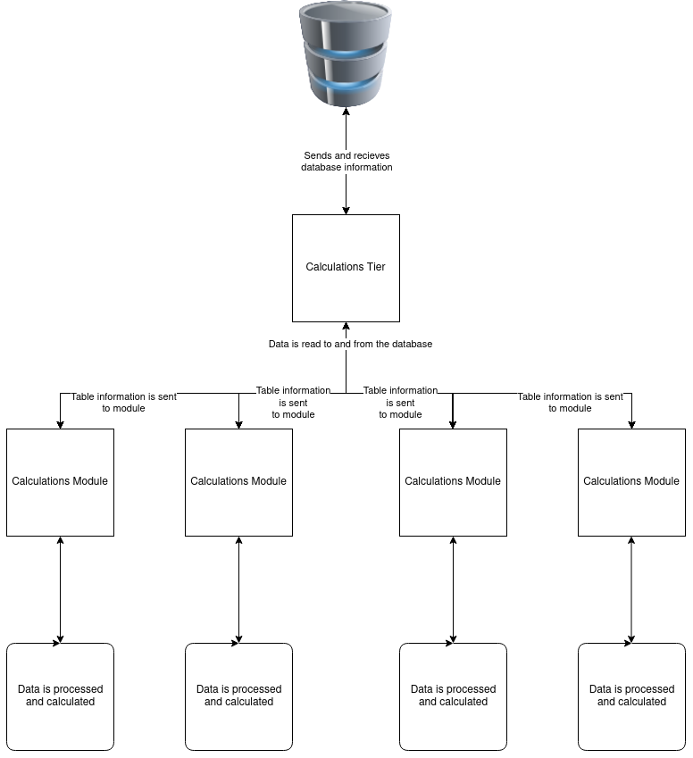
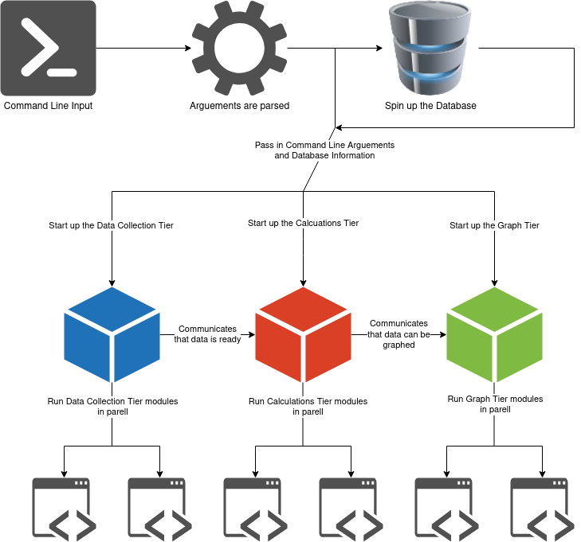

:github_url: https://github.com/SoftwareSystemsLaboratory/Metrics-Dashboard

.. index:: architecture

Architecture
============

.. contents:: Table of Contents
    :depth: 2
    :local:
    :backlinks: top

.. _overview_link:

.. index:: overview

Overview
--------

The current architecture of the `SSL Metrics Dashboard <../index.html>`_ is fairly simple and straightforward.

There are essentially three tiers to the dashboard that are built on top of each other. In the order of the lowest tier to the highest tier, there is the:

1. :ref:`Data Collection Tier <data_collection_tier_link>`
2. :ref:`Calculations Tier <calculations_tier_link>`
3. :ref:`Graph Tier <graph_tier_link>`
4. :ref:`Execution Tier <execution_tier_link>`

.. note::
    The :ref:`Execution Tier <execution_tier_link>` is more of a wrapper that wraps then a proper tiers together. None the less, it should have its own spot on this list as of how important it is.

Each on of these tiers rightfully deserve their own subsection in order for a complete explanation as to what they do. However, in essence the:

* :ref:`Data Collection Tier <data_collection_tier_link>` is responsible for accessing the GitHub API and collecting information on a specific repository.

* :ref:`Calculations Tier <calculations_tier_link>` is responsible for taking the information in the :doc:`SQLlite Database <projectTooling>` and performing math to generate software metrics.

* :ref:`Graph Tier <graph_tier_link>` is responsible for accessing the :doc:`SQLlite Database <projectTooling>` table and graphing said values. Since the metrics are calcualted for every day since the repository's creation, the graphs can allow for developers, project managers, and the public eye to monitor the health and growth of a project over time.

* :ref:`Execution Tier <execution_tier_link>` is responsible for wrapping all of the previously mentioned tiers together. Furthermore, this tier is responsible for the parellization of tasks and transforming the user's input (that's :doc:`YOU <userGuide>`!) into data that the other tiers can utilize.

.. _main_pipeline_link:
.. index:: main pipeline

Main Pipeline
-------------

The pipeline is essentially how `SSL Metrics Dashboard <../index.html>`_ collects, handles, and stores data. Some of the steps of the pipeline where described above, however this subsection is meant to provide a concrete understanding of the pipeline that is in place.

Quite franly, the pipline is best described using a diagram. So please take a look at the one below.

.. figure:: images/pipelineNoExecution.png
    :scale: 50%
    :alt: Pipeline for Metrics Dashboard without the :ref:`Execution Tier <execution_tier_link>`.
    :align: center

    Pipeline for Metrics Dashboard without the Execution tier. :download:`Source <files/pipelineNoExecution.drawio>`

Looking at the pipeline as it stands, there are a few key items to point out:

1. There is no :ref:`Execution Tier <execution_tier_link>` in this pipline diagram.
2. There appears to be a bottleneck which prevents the :ref:`Calculations Tier <calculations_tier_link>` from running until the data from the :ref:`Data Collection Tier <data_collection_tier_link>` tier has been stored into the table **CENTRAL**.
3. There appears to be another bottleneck which prevents the :ref:`Graph Tier <graph_tier_link>` from running until the data from the :ref:`Calculations Tier <calculations_tier_link>` has been stored into **CENTRAL**.

The first of these points is trivial to answer. While the second and third point do have technical and practical reasons for why they appear as they are in the graph.

To provide an answer to the first point, the :ref:`Execution Tier <execution_tier_link>` is missing from this pipeline diagram is because it simply does not fit in. The :ref:`Execution Tier <execution_tier_link>` is purely meant to spin up all of the other tiers by providing helper functions. These functions mostly revolve around I/O operations such as ensuring that **CENTRAL** has been created and passing along command line arguements to the tiers so that they can format their outputs correctly.

The second point has a more technical answer. Essentially, there is no bottleneck in practice, only in the diagram. This is because :doc:`SQLlite <projectTooling>` has a feature called **Write-Ahead Logging (WAL)** which can be learned about `here <https://sqlite.org/wal.html>`_. What this features allows `SSL Metrics Dashboard <../index.html>`_ to do is write to different tables all at once without worrying about a race condition. This is an enforced safety feature because every module writes to its own specific table.

Unlike the second point, there is an actual bottleneck between the :ref:`Calculations Tier <calculations_tier_link>` and the :ref:`Graph Tier <graph_tier_link>`. This is because the :ref:`Graph Tier <graph_tier_link>` needs to make sure that all of the data has been calculated before displaying a graph. Without this bottleneck, graphs could be presented as incomplete at best and down right wrong at worst. Thus, there is a bottleneck between the modules to enforce that the graphs will be accurate.

This does not mean that every calculation needs to be completed before they are graphed. Rather, it means that each specific calculation must be completed before its specific graph(s) can be displayed. Thus, if one calculation is taking longer than another, that works. The completed calculation can be plotted and displayed.

.. _github_api_link:
.. index:: github api overview

GitHub API
^^^^^^^^^^

Metrics Dashboard utilizes the `GitHub REST API v3 <https://docs.github.com/en/free-pro-team@latest/rest>`_ in order to extract repository information. This provides a simple, yet limited, view into a repositories meta information.

The simplicity of the view is derived from the JSON content that is returned per request. With every request, we get a full and complete look at all of the information associated with a particular data set.

As an example, gathering all of the information associated with repository's Issues can be collected via one URI (`https://api.github.com/SoftwareSystemsLaboratory/Metrics-Dashboard/issues? <https://api.github.com/SoftwareSystemsLaboratory/Metrics-Dashboard/issues?>`_) and will return not only the most recent 30 issues, but also (and not limited to):

* Who created the issue
* Who is assigned to the issue
* Issue labels
* Issue title and description

All of this data is in an easy to read and parse and extracted to a :doc:`SQLlite Database <projectTooling>` with ease.

.. todo::
    Move all of this to the project tooling page

At the time of writing, there are several projects out there that interact with the GitHub REST API. However, for the purposes of this project it is much simpler to create a custom REST API handler. The reason being is that the projects that handle the REST API are too robust; they have too many features that this project simply does not need.

This custom handler is able to:

* Authenticate itself with GitHub
* Send GET requests to the GitHub REST API with the appropriate headers, parameters, and request body
* Convert the response from the afore mentioned GET call into JSON
* Return the response headers from the afore mentioned GET call

.. _data_collection_tier_link:
.. index:: data collection tier

Data Collection Tier
^^^^^^^^^^^^^^^^^^^^

The :ref:`Data Collection Tier <data_collection_tier_link>` has four tasks that it must accomplish:

1. Get the data from the :ref:`GitHub API <github_api_link>`
2. Extract data from the API response(s)
3. Format the extracted data into SQLlite compatible data types
4. Store the formatted data into the SQLlite database into its respected table

From a technical standpoint, this is probably the simplest of the four tiers to develop. It is also has to be the most robust of the four.

The simplicity is derived from its lack of computations. Aside from changing data types and manipulating JSON data, there is little to no computations required for the :ref:`Data Collection Tier <data_collection_tier_link>` to execute in order to accomplish its goal.

Below is a diagram of how a :ref:`Data Collection Tier <data_collection_tier_link>` module would interact with its tier controller and other :ref:`Data Collection Tier <data_collection_tier_link>` modules.

.. figure:: images/dataCollectionTier.png
    :scale: 50%
    :alt: Pipeline for Metrics Dashboard :ref:`Data Collection Tier <data_collection_tier_link>`.
    :align: center

    Pipeline for Metrics Dashboard :ref:`Data Collection Tier <data_collection_tier_link>`. :download:`Source <files/dataCollectionTier.drawio>`

.. _calculations_tier_link:
.. index:: calculations tier

Calculations Tier
^^^^^^^^^^^^^^^^^

The :ref:`Calculations Tier <calculations_tier_link>` is the computationally heavy tier of the project. Here, data is read from the :doc:`SQLlite Database <projectTooling>` and software metrics are computed with respect to which table the data is stored in. These metrics are then stored back within the same database from which they were read, however now in a different table.

As there are many software metrics out there, only a select few that are computed in this project will be listed below:

* :doc:`Number of Issues per Day <userGuide>`
* :doc:`Number of Commits per Day <userGuide>`
* :doc:`Defect Density per Day <userGuide>`
* :doc:`Issue Spoilage per Day <userGuide>`

One should notice that the metrics listed above are calculated at a singular time interval. The reason being for this is that if metrics are calcualted on a more granular level, the focus of the Metrics Dashboard project changes from a **project wide** metrics analysis to that of an :doc:`Individual Developer <developerGuide>` metrics analysis. Furthermore, if metrics were calculated on a weekly, monthly, or yearly basis then many more tables would need to be created within the SQLlite database, adding more to the already growing space complexity of the program.

Below is a diagram of how a :ref:`Calculations Tier <calculations_tier_link>` module would interact with its tier controller and other :ref:`Calculations Tier <calculations_tier_link>` modules.

    Pipeline for Metrics Dashboard :ref:`Calculations Tier <calculations_tier_link>`. :download:`Source <files/calculationsTier.drawio>`

.. _graph_tier_link:
.. index:: graph tier

Graph Tier
^^^^^^^^^^

.. todo::
    Have Sophie write up the architecture of the Graph Tier

.. todo::
    Create an architecture diagram of how a module would interact within the tier

.. _execution_pipeline_link:
.. index:: execution pipeline

Execution Pipeline
------------------

The pipeline is essentially how `SSL Metrics Dashboard <../index.html>`_ collects and handle command line arguements and executes the modules of the different tiers. Some of the steps of the pipeline were mentioned above, however this subsection is meant to provide a concrete understanding of the pipeline that is in place.

Quite franly, the pipline is best described using a diagram. So please take a look at the one below.

    Execution Pipeline for Metrics Dashboard. :download:`Source <files/executionPipeline.drawio>`

Looking at the pipeline as it stands, there are a few key items to point out:

1. The :doc:`SQLlite Database <projectTooling>` is created before any tier is executed.
2. The tiers are executed before the individual modules within those tiers

The first of these points is trivial to answer. While the second point has a practical reason for why it appears the way it is.

To provide an answer to the first point, the :doc:`SQLlite Database <projectTooling>` is created before any of the tiers are ran in order to assure that the tiers can all interact with the same database. Without this step, every tier would have to generate its own unique database, and then the databases would be merged back into one before the :ref:`Graph Tier <graph_tier_link>` could be executed.

The second point has both a technical and practical reason for being the way that it is. The practical reason is to abstract the tiers from one another. The point of the tiers and module seperation is so that the tiers act as controllers for said modules. This way, the view of the application (in this instance a command line interface) does not have to do a ton of preprocessing to spin up the program. Rather the tiers handle that providing both a layer of abstraction that allows for better tests to be created and a larger test coverage to be achieved as well as the ability for each tier to be executed as its own seperate program if the situation calls for it.

All tiers are ran sequentially, while all modules within a tier are ran in parell. This is because each tier is reliant upon the one before it to complete its task before it can begin its own. However, the individual modules do not need to interact with each other to accomplish the same task. They may all accomplish the same goal within in a modules, and may even do similar steps to achieve that goal, but they themselves are not reliant upon one another to achieve that goal.

.. _execution_tier_link:
.. index:: execution tier

Execution Tier
^^^^^^^^^^^^^^

.. todo::
    Create an architecture diagram of how a module would interact within the tier
